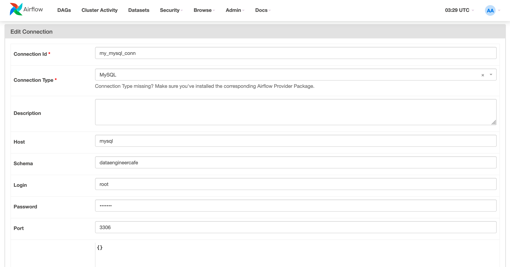

# With MySQL

## Setting up Airflow

```bash
mkdir -p ./dags ./logs ./plugins ./config
echo -e "AIRFLOW_UID=$(id -u)" > .env
```

### MySQL Connection



## References

- [Running Airflow in Docker: Initializing Environment](https://airflow.apache.org/docs/apache-airflow/stable/howto/docker-compose/index.html#initializing-environment)
